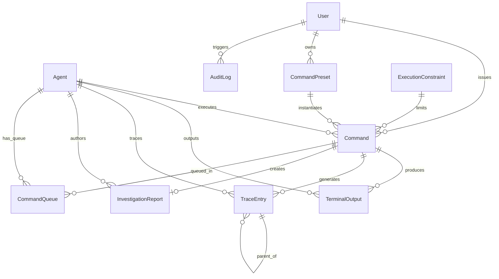

# Data Model: Onsembl.ai Agent Control Center

**Date**: 2025-01-15
**Branch**: `001-build-onsembl-ai`
**Source**: Requirements from [spec.md](./spec.md)

## Overview
This document defines the core data entities and their relationships for the Onsembl.ai Agent Control Center. All entities are designed for storage in Supabase PostgreSQL with appropriate indexes for real-time queries.

## Entity Definitions

### 1. Agent
Represents an AI coding assistant connected to the control center.

**Fields**:
- `id` (UUID): Unique identifier for the agent
- `name` (String): Display name (e.g., "Claude-1", "Gemini-2")
- `type` (Enum): Agent type - `CLAUDE` | `GEMINI` | `CODEX`
- `status` (Enum): Connection status - `ONLINE` | `OFFLINE` | `CONNECTING` | `ERROR`
- `activity_state` (Enum): Current activity - `IDLE` | `PROCESSING` | `QUEUED`
- `host_machine` (String): Identifier of the host machine running the agent
- `connected_at` (Timestamp): Last successful connection time
- `disconnected_at` (Timestamp, nullable): Last disconnection time
- `health_metrics` (JSONB): Real-time health data
  - `cpu_usage` (Number): Percentage CPU usage
  - `memory_usage` (Number): Memory in MB
  - `uptime` (Number): Seconds since agent start
  - `commands_processed` (Number): Total commands executed
  - `average_response_time` (Number): Average ms per command
- `config` (JSONB): Agent configuration
  - `server_url` (String): Control server WebSocket URL
  - `auto_reconnect` (Boolean): Enable auto-reconnection
  - `max_retries` (Number): Max reconnection attempts
- `created_at` (Timestamp): Agent first registration time
- `updated_at` (Timestamp): Last update time

**Constraints**:
- Unique index on `id`
- Index on `type`, `status` for filtering
- Check constraint: `status` must be valid enum value

### 2. Command
User input sent to one or more agents for execution.

**Fields**:
- `id` (UUID): Unique command identifier
- `user_id` (UUID): ID of user who issued the command
- `content` (Text): The command text (natural language or structured verb)
- `type` (Enum): Command type - `NATURAL` | `INVESTIGATE` | `REVIEW` | `PLAN` | `SYNTHESIZE`
- `target_agents` (UUID[]): Array of target agent IDs
- `broadcast` (Boolean): Whether command was sent to all agents
- `status` (Enum): Execution status - `PENDING` | `QUEUED` | `EXECUTING` | `COMPLETED` | `FAILED` | `CANCELLED`
- `priority` (Integer): Queue priority (0-100, higher = more urgent)
- `execution_constraints` (JSONB): Limits applied to execution
  - `time_limit_ms` (Number): Max execution time in milliseconds
  - `token_budget` (Number): Max tokens to consume
- `started_at` (Timestamp, nullable): Execution start time
- `completed_at` (Timestamp, nullable): Execution completion time
- `error` (Text, nullable): Error message if failed
- `created_at` (Timestamp): Command creation time
- `updated_at` (Timestamp): Last status update

**Constraints**:
- Foreign key to users table via `user_id`
- Index on `status`, `created_at` for queue management
- Check constraint: `priority` between 0 and 100

### 3. TerminalOutput
Timestamped output from agent command execution.

**Fields**:
- `id` (UUID): Unique output identifier
- `command_id` (UUID): Associated command ID
- `agent_id` (UUID): Source agent ID
- `stream_type` (Enum): Output stream - `STDOUT` | `STDERR`
- `content` (Text): The output text
- `ansi_codes` (Boolean): Whether content contains ANSI escape codes
- `timestamp` (Timestamp): When output was generated
- `sequence` (Integer): Order within command execution
- `created_at` (Timestamp): Record creation time

**Constraints**:
- Foreign key to commands table via `command_id`
- Foreign key to agents table via `agent_id`
- Composite index on `command_id`, `sequence` for ordered retrieval
- Index on `timestamp` for time-based queries

### 4. CommandPreset
Saved command template for reuse across sessions.

**Fields**:
- `id` (UUID): Unique preset identifier
- `user_id` (UUID): Owner of the preset
- `name` (String): Display name for the preset
- `description` (Text, nullable): Detailed description
- `content` (Text): The command template
- `type` (Enum): Command type (same as Command.type)
- `target_agent_types` (Enum[], nullable): Default agent types to target
- `variables` (JSONB, nullable): Template variables to replace
  - Array of `{name: string, description: string, default?: string}`
- `usage_count` (Integer): Number of times used
- `last_used_at` (Timestamp, nullable): Last usage timestamp
- `created_at` (Timestamp): Preset creation time
- `updated_at` (Timestamp): Last modification time

**Constraints**:
- Foreign key to users table via `user_id`
- Unique constraint on `user_id`, `name`
- Index on `usage_count` for popularity sorting

### 5. TraceEntry
Hierarchical record of LLM prompts and tool calls made by agents.

**Fields**:
- `id` (UUID): Unique trace identifier
- `command_id` (UUID): Associated command ID
- `agent_id` (UUID): Agent that generated the trace
- `parent_id` (UUID, nullable): Parent trace entry for hierarchy
- `type` (Enum): Trace type - `LLM_PROMPT` | `TOOL_CALL` | `RESPONSE`
- `name` (String): Display name (e.g., "GPT-4 Call", "File Read")
- `content` (JSONB): Trace data
  - For LLM_PROMPT: `{prompt: string, model: string, temperature?: number}`
  - For TOOL_CALL: `{tool: string, args: object, result?: any}`
  - For RESPONSE: `{content: string, tokens_used?: number}`
- `started_at` (Timestamp): Trace start time
- `completed_at` (Timestamp, nullable): Trace completion time
- `duration_ms` (Integer, nullable): Execution duration in milliseconds
- `tokens_used` (Integer, nullable): Tokens consumed
- `error` (Text, nullable): Error if trace failed
- `metadata` (JSONB, nullable): Additional trace metadata
- `created_at` (Timestamp): Record creation time

**Constraints**:
- Foreign key to commands table via `command_id`
- Foreign key to agents table via `agent_id`
- Self-referential foreign key via `parent_id`
- Index on `parent_id` for tree traversal
- Index on `command_id`, `started_at` for timeline queries

### 6. InvestigationReport
Structured document generated by agents during investigations.

**Fields**:
- `id` (UUID): Unique report identifier
- `command_id` (UUID): Command that generated the report
- `agent_id` (UUID): Agent that created the report
- `title` (String): Report title
- `summary` (Text): Executive summary
- `status` (Enum): Report status - `DRAFT` | `IN_PROGRESS` | `COMPLETE`
- `content` (JSONB): Structured report data
  - `sections`: Array of report sections
    - `{title: string, content: string, type: string, order: number}`
  - `findings`: Array of key findings
    - `{description: string, severity: string, evidence: string[]}`
  - `recommendations`: Array of recommendations
    - `{action: string, priority: string, rationale: string}`
  - `metadata`: Additional report metadata
- `attachments` (JSONB[], nullable): Referenced files or data
  - `{name: string, type: string, url?: string, content?: string}`
- `vector_embedding` (Vector, nullable): For future semantic search
- `created_at` (Timestamp): Report creation time
- `updated_at` (Timestamp): Last modification time
- `completed_at` (Timestamp, nullable): Report completion time

**Constraints**:
- Foreign key to commands table via `command_id`
- Foreign key to agents table via `agent_id`
- Index on `status`, `created_at` for report management
- GIN index on `content` for JSONB queries
- Future: Vector index on `vector_embedding` for similarity search

### 7. AuditLog
Persistent record of all system events with 30-day retention.

**Fields**:
- `id` (UUID): Unique audit log identifier
- `event_type` (Enum): Event category
  - `AGENT_CONNECT` | `AGENT_DISCONNECT` | `COMMAND_SENT` | `COMMAND_COMPLETED`
  - `EMERGENCY_STOP` | `TOKEN_LIMIT_EXCEEDED` | `TIME_LIMIT_EXCEEDED`
  - `USER_LOGIN` | `USER_LOGOUT` | `PRESET_CREATED` | `PRESET_USED`
- `user_id` (UUID, nullable): User associated with event
- `agent_id` (UUID, nullable): Agent associated with event
- `command_id` (UUID, nullable): Command associated with event
- `details` (JSONB): Event-specific data
- `ip_address` (INET, nullable): Client IP for user events
- `user_agent` (String, nullable): Browser/client information
- `created_at` (Timestamp): Event timestamp

**Constraints**:
- Indexes on `event_type`, `created_at` for filtering
- Index on `user_id`, `agent_id`, `command_id` for entity queries
- Partition by month for efficient retention management

### 8. ExecutionConstraint
Reusable constraint profiles for agent operations.

**Fields**:
- `id` (UUID): Unique constraint identifier
- `name` (String): Display name
- `description` (Text, nullable): Detailed description
- `time_limit_ms` (Integer, nullable): Max execution time in milliseconds
- `token_budget` (Integer, nullable): Max tokens to consume
- `memory_limit_mb` (Integer, nullable): Max memory usage in MB
- `cpu_limit_percent` (Integer, nullable): Max CPU usage percentage
- `is_default` (Boolean): Whether this is the default constraint
- `created_at` (Timestamp): Creation time
- `updated_at` (Timestamp): Last modification time

**Constraints**:
- Unique constraint on `name`
- Only one record can have `is_default = true`
- Check constraints for positive values on all limits

### 9. CommandQueue
Queue management for pending commands per agent.

**Fields**:
- `id` (UUID): Unique queue entry identifier
- `command_id` (UUID): Queued command ID
- `agent_id` (UUID): Target agent ID
- `position` (Integer): Position in queue (1-based)
- `priority` (Integer): Inherited from command priority
- `status` (Enum): Queue status - `WAITING` | `PROCESSING` | `INTERRUPTED`
- `enqueued_at` (Timestamp): When command was queued
- `started_at` (Timestamp, nullable): When processing began
- `interrupt_requested` (Boolean): Whether interruption was requested
- `interrupt_reason` (Text, nullable): Reason for interruption

**Constraints**:
- Foreign key to commands table via `command_id`
- Foreign key to agents table via `agent_id`
- Unique constraint on `agent_id`, `position` when `status = 'WAITING'`
- Index on `agent_id`, `status`, `priority` for queue operations

## Relationships

## Indexes and Performance

### Primary Indexes
- All `id` fields have unique B-tree indexes
- All foreign key fields have B-tree indexes

### Composite Indexes
- `agents(type, status)` - Agent filtering
- `commands(status, created_at)` - Queue management
- `terminal_outputs(command_id, sequence)` - Ordered output retrieval
- `trace_entries(command_id, started_at)` - Timeline queries
- `audit_logs(event_type, created_at)` - Log filtering
- `command_queue(agent_id, status, priority)` - Queue operations

### Special Indexes
- GIN index on all JSONB fields for containment queries
- BRIN index on `created_at` fields for time-series queries
- Future: IVFFlat index on `investigation_reports.vector_embedding` for similarity search

## Data Retention Policies

### 30-Day Retention
- `audit_logs` - Partitioned by month, old partitions dropped
- `terminal_outputs` - Archived to S3 after 30 days, deleted after 90 days

### Indefinite Retention
- `agents` - Core system data
- `commands` - Historical reference
- `command_presets` - User data
- `investigation_reports` - Knowledge base
- `trace_entries` - Debugging and analysis

### Cleanup Jobs
- Daily: Remove orphaned `command_queue` entries
- Daily: Update `agent.status` for disconnected agents > 1 hour
- Weekly: Vacuum and analyze all tables
- Monthly: Drop old `audit_logs` partitions

## Migration Strategy

### Initial Schema (v0.1.0)
1. Create Supabase project
2. Apply RLS policies for single-tenant access
3. Create tables in dependency order
4. Add indexes after initial data load
5. Enable real-time subscriptions for `agents` and `commands`

### Future Enhancements (Post-MVP)
1. Add vector embeddings to `investigation_reports`
2. Implement table partitioning for `terminal_outputs`
3. Add materialized views for dashboard metrics
4. Implement row-level security for multi-tenant support
5. Add full-text search indexes on report content