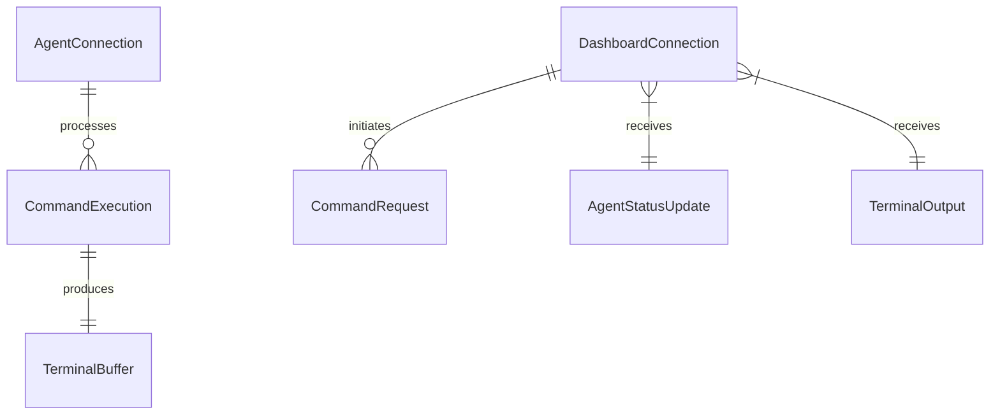

# Data Model: WebSocket Communication

## Core Entities

### DashboardConnection
Represents an active WebSocket connection from a dashboard client to the backend server.

**Fields**:
- `id`: string (UUID) - Unique connection identifier
- `userId`: string - Authenticated user identifier
- `connectionTime`: Date - When connection was established
- `lastActivity`: Date - Last message received from client
- `state`: ConnectionState - Current connection state
- `clientInfo`: ClientInfo - Browser and system information

**State Transitions**:
```
CONNECTING → CONNECTED → DISCONNECTED
         ↓           ↑
      RECONNECTING ←─┘
```

**Validation Rules**:
- userId must be valid authenticated user
- connectionTime <= lastActivity
- state transitions must follow defined flow

### AgentConnection
Represents a WebSocket connection from an AI agent to the backend server.

**Fields**:
- `agentId`: string - Unique agent identifier
- `agentType`: 'claude' | 'gemini' | 'codex' - Type of AI agent
- `connectionTime`: Date - When agent connected
- `lastHeartbeat`: Date - Last heartbeat received
- `status`: AgentStatus - Current agent status
- `capabilities`: string[] - What commands agent supports
- `currentCommand`: string | null - Active command ID if executing

**Status Values**:
- `online`: Agent connected and idle
- `busy`: Agent executing command
- `offline`: Agent disconnected

**Validation Rules**:
- agentId must be unique across active connections
- lastHeartbeat within 30 seconds for online status
- currentCommand only set when status is 'busy'

### CommandExecution
Tracks command execution from request to completion.

**Fields**:
- `id`: string (UUID) - Unique command identifier
- `agentId`: string - Target agent
- `command`: string - Command to execute
- `priority`: 'high' | 'normal' | 'low' - Execution priority
- `status`: CommandStatus - Current execution state
- `requestedBy`: string - User ID who requested
- `requestedAt`: Date - When command was requested
- `startedAt`: Date | null - When execution started
- `completedAt`: Date | null - When execution completed
- `exitCode`: number | null - Command exit code

**Status Values**:
- `queued`: In queue waiting for agent
- `running`: Currently executing
- `completed`: Successfully finished
- `failed`: Execution error
- `interrupted`: Stopped by user/system

**Validation Rules**:
- requestedAt <= startedAt <= completedAt (when set)
- exitCode only set when status is 'completed' or 'failed'
- priority affects queue position

### TerminalBuffer
Manages streaming terminal output for display.

**Fields**:
- `commandId`: string - Associated command
- `chunks`: OutputChunk[] - Output segments
- `totalBytes`: number - Total output size
- `isComplete`: boolean - All output received

**OutputChunk**:
- `sequence`: number - Order in stream
- `data`: string - Terminal output text
- `timestamp`: Date - When received
- `type`: 'stdout' | 'stderr' - Output stream

**Validation Rules**:
- sequence numbers must be sequential
- totalBytes <= 1MB (max payload size)
- chunks ordered by sequence

## Message Types

### Client → Server Messages

**DashboardConnect**
```typescript
{
  type: 'dashboard:connect'
  version: '1.0.0'
  token: string // JWT auth token
  clientInfo: {
    userAgent: string
    timezone: string
  }
}
```

**CommandRequest**
```typescript
{
  type: 'command:request'
  version: '1.0.0'
  agentId: string
  command: string
  priority: 'high' | 'normal' | 'low'
}
```

**CommandInterrupt**
```typescript
{
  type: 'command:interrupt'
  version: '1.0.0'
  commandId: string
}
```

### Server → Client Messages

**AgentStatusUpdate**
```typescript
{
  type: 'agent:status'
  version: '1.0.0'
  agentId: string
  status: 'online' | 'busy' | 'offline'
  timestamp: number
}
```

**TerminalOutput**
```typescript
{
  type: 'terminal:output'
  version: '1.0.0'
  commandId: string
  data: string
  stream: 'stdout' | 'stderr'
  sequence: number
}
```

**CommandStatusUpdate**
```typescript
{
  type: 'command:status'
  version: '1.0.0'
  commandId: string
  status: 'queued' | 'running' | 'completed' | 'failed' | 'interrupted'
  exitCode?: number
}
```

## Relationships



## Constraints

### Performance Constraints
- Max 50 DashboardConnections concurrent
- Max 10 AgentConnections concurrent
- Max 1MB per WebSocket message
- Terminal output buffered in 10KB chunks
- Heartbeat every 30 seconds for keep-alive

### Data Retention
- TerminalBuffer retained for active session only
- CommandExecution history persisted to database
- Connection logs retained for 30 days (audit)

### Concurrency Rules
- One command per agent at a time
- Commands queued per agent with priority
- Broadcasts to all dashboards must complete in <50ms
- Terminal output streamed with max 50ms delay

## State Management

### Client State (Zustand)
```typescript
interface WebSocketState {
  connectionStatus: 'connecting' | 'connected' | 'disconnected' | 'error'
  agents: Map<string, AgentStatus>
  activeCommand: CommandExecution | null
  terminalOutput: string[]
  error: Error | null
}
```

### Server State (In-Memory)
```typescript
interface ServerState {
  dashboards: Map<string, DashboardConnection>
  agents: Map<string, AgentConnection>
  commandQueue: Map<string, CommandExecution[]> // Per agent
  terminalBuffers: Map<string, TerminalBuffer>
}
```

## Error Scenarios

### Connection Errors
- **WebSocket upgrade fails**: Return HTTP 426 Upgrade Required
- **Authentication fails**: Close with code 1008 (Policy Violation)
- **Max connections exceeded**: Close with code 1013 (Try Again Later)

### Command Errors
- **Agent offline**: Return error message, don't queue
- **Command timeout**: Mark as failed after 5 minutes
- **Invalid command**: Validate before queuing

### Streaming Errors
- **Buffer overflow**: Drop oldest chunks, log warning
- **Client disconnect during stream**: Clean up buffer
- **Compression fails**: Send uncompressed with flag